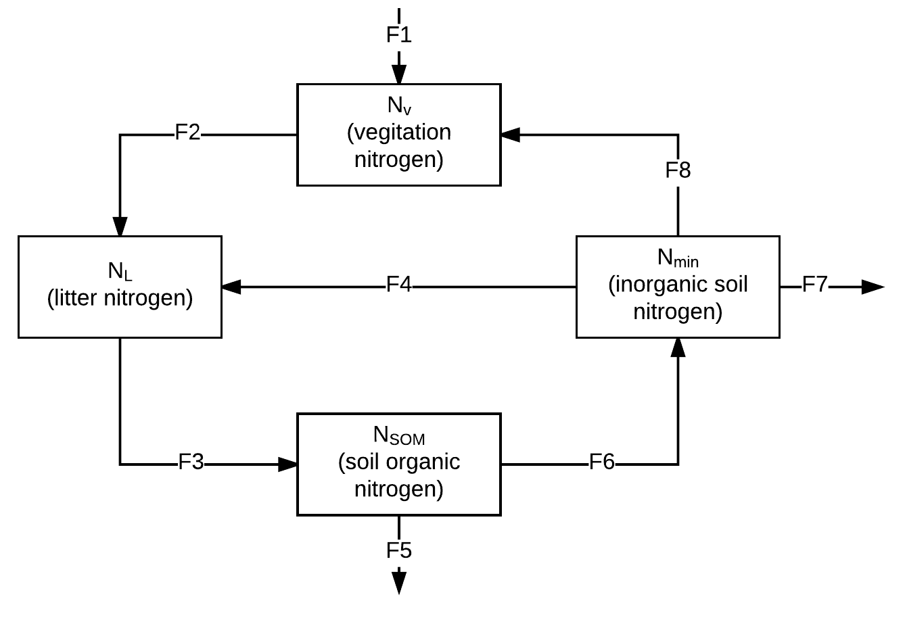

```{r setup, include=FALSE}
knitr::opts_chunk$set(echo = TRUE, root.dir = FALSE)
```

## Goals for lab

-	Apply skills used to solve differential equations to a new problem
-	Practice the use of a standardized approach to coding differential equations in R
-	Demonstrate the ability to use Euler and deSolve to solve a differential equation
-	Demonstrate the ability to use the ‘curve’ function to visualize a function
-	Practice writing differential equations from a conceptual model

## Solving differential equations

The logistic equation is a classic equation used to simulate the dynamics of a population (N; in individuals m-2) that has a carrying capacity.  Read about the formula on S&H Chapter 2 page 45.  The equation is:

$$\frac{dN}{dt} = rN(1-\frac{N}{K})$$

where r and K are parameters: r is the per-capita growth rate (`individuals individual^-1 yr^-1`), and K is the carrying capacity (`individuals m^-2`).  The key to understanding a differential equation is to remember that it predicts the rate of change of a stock rather than the size of a stock.  Therefore, we do not directly know the size of a stock at a particular time from the equation; we only know how it changes.  To get the size of the stock at a future time we need to:

1) Numerically solve the differential equation using a computer like we did in Lab 3

or 

2) Use calculus to integrate the equation by hand and solve for an equation were the lefthand side is biomass (a stock) rather than biomass change (dB/dt).  This equation is called the general solution.

The general solution for the logistic growth equation is:

$$N(t) = \frac{K}{1 + {ce}^{-rt}}$$
where `N(t)` is the population size at a particular time (`t`) and `c` is the integration constant.  You know the parameters `r` and `K` but do not know `c` without solving for it.  For example if you know that 

$$N(0) = {N_{o}}$$

you can set t = 0 and N(t) = No and solve for c.  Once you solve for c the equation is called the particular solution.

**Question 1**: 

Solve for the c given that N(0) = No.

**Answer 1**:

To plot the logistic equation, use the curve function in R (see examples from this lab's materials).  I really like the curve function because it is an easy tool for visualizing equations that I see in papers.  To use the curve function, first write a function for the particular solution that plots population as a function of time.

```{r}
logistic_growth <- function(x, No, K, r){
  #note that the function MUST have x as the first argument and x is the thing that R will vary to make the curve.  I always convert the x to the variable that it represents in the code (in this case, the variable t)
  t <- x
  
  #INSERT PARTICULAR SOLUTION HERE
  
}
```

**Question 2:** 

Plot the particular solution for t 0 through 100 years with the following parameter values.

1)  r = 0.1, K = 10, and No = 1

2)  r = 0.1, K = 30, and No = 1

3)  r = 0.1, K = 10, and No = 20

Use the curve function to generate the plot.  You can use the `add=TRUE` option in the curve function to plot the curve on an existing plot.  Paste the plot code below.

**Answer 2**:

```{r}
  curve(logitic_growth(x, No = INSERT, K = INSERT, r = INSERT))
  curve(logitic_growth(x, No = INSERT, K = INSERT, r = INSERT), add=TRUE)
```

**Question 3:** 

Describe how varying `K` and `N0` influences the shape of the curve.

**Answer 3:**

**Question 4:** 

Write a function in R describing the logistic differential equation (not the solution).  Use the function form that we covered for the simple forest model earlier in the lab.  Paste function below.

**Answer 4**:
```{r}
#INSERT ANSWER 3 HERE

```

**Question 5:** 

Solve the logistic growth equation (r = 0.1, K=10, and No= 1) using the **Euler method** from the `euler_method_example.Rmd` file.  Run the model for 400 years with time steps of 1,10, and 40 years.  Paste code and a plot of the three simulations below (put all three simulations on the same plot)

**Answer 5**:
```{r}
#INSERT CODE TO SOLVE THE DIFFERENTIAL EQUATION WITH THE DIFFERENT TIME STEPS

```

```{r}
#INSERT PLOT

```

**Question 6**: 

Question 6: Solve the logistic growth (r = 0.1, K=10, and No= 1) using the **deSolve method**. Run the model for 400 years with time steps of 1, 10, and 40 years (r = 0.1, K = 10, and No = 1).  Paste code and a plot of the three simulations below. (put all three simulations on the same plot)

**Answer 6**:
```{r}
#INSERT CODE TO SOLVE THE DIFFERENTIAL EQUATION WITH THE DIFFERENT TIME STEPS

```

```{r}
#INSERT PLOT

```

**Question 7:**  

Which method (Euler or deSolve) is most accurate across all the time-steps?

**Answer 7:**

##Translating conceptual diagrams to differential equations

Here is a conceptual diagram for a simple model describing the forest nitrogen cycle.  The boxes are stocks (Nv,NL, Nmin, Nsom), and the arrows are the fluxes. To keep the exercise general, the fluxes are just given as numbers (F1, F2, etc.)  



*DELETE THIS AFTER YOU GET THE FIGURE TO APPEAR*
*To get the figure above to show up, download nitrogen_cycle_figure.png from Canvas, move to a folder, and insert the file location after the "![]" above.*

**Question 8:** 

Write the system of differential equations that describes the figure above.  There will be an equation for each stock, and use the flux names to write the balance equation for each stock.

**Answer 8:**


